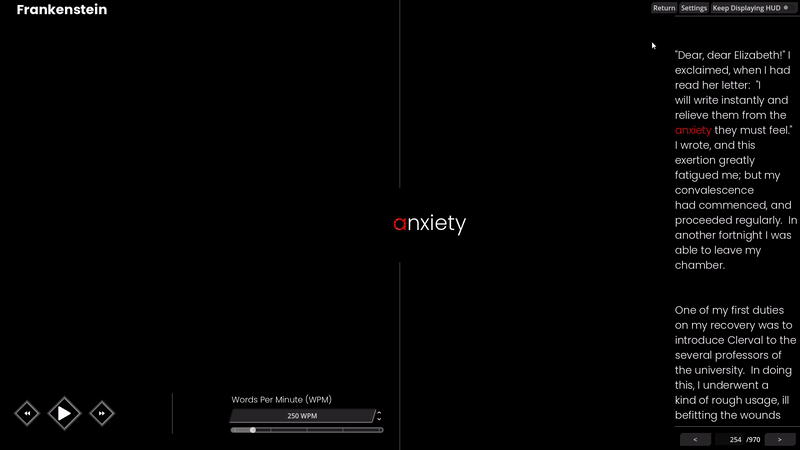
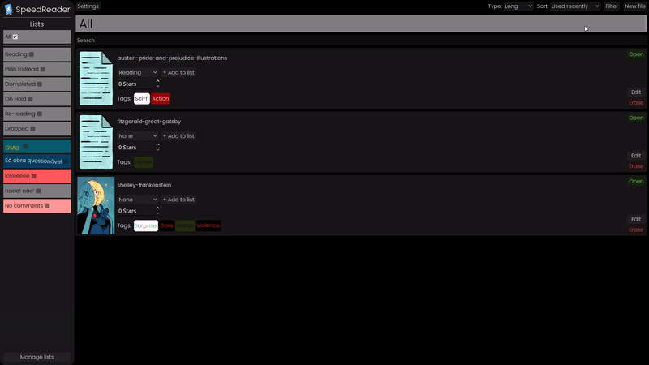

# SpeedReader

## English

A text reader made with the Godot Engine, based on the RSVP (Rapid Serial Visual Presentation) technique, where the content is displayed word by word in the same spot on the screen, allowing you to read without having to move your eyes.

Ideal for studying, training your brain, speed reading, and accessibility.

You can switch between themes to find what feels most comfortable for reading.

You can import a file from the extensions: txt, doc, docx, pdf, epub.

The imported file will be transformed into a book. You can add custom tags, lists and even more.

You can also choose your reading speed, measured in Words Per Minute (WPM).

## Português

Um leitor de textos feito na Godot Engine, baseado na técnica RSVP (Rapid Serial Visual Presentation), onde o conteúdo é exibido palavra por palavra no mesmo ponto da tela, permitindo leitura sem precisar mover os olhos.

Ideal para estudos, treinar seu cérebro, leitura rápida e acessibilidade.

Você pode variar entre os temas para o que fica mais confortável na leitura.

Você pode importar arquivos nas extensões: txt, doc, docx, pdf, epub.

O arquivo importado será transformado em um livro. Você pode adicionar tags personalizadas, listas e muito mais.

Você também pode escolher a velocidade da sua leitura, a medida é feita em Palavras por Minuto (PPM).

