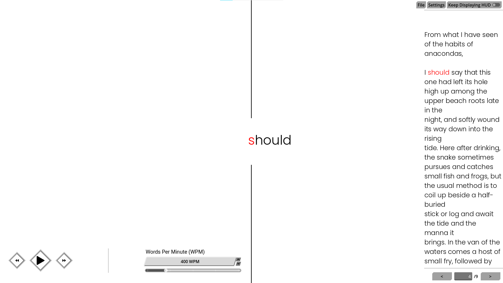
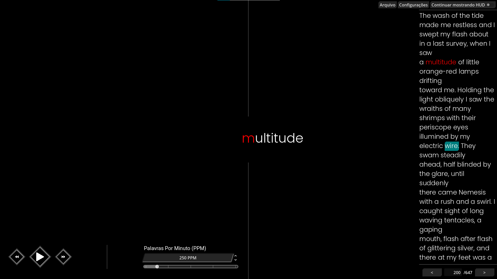
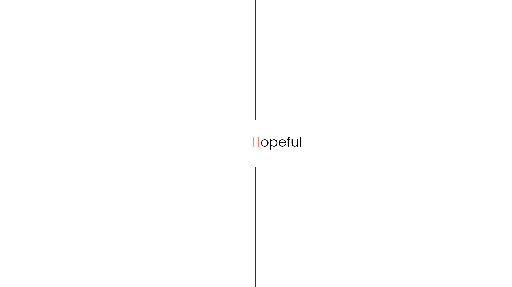
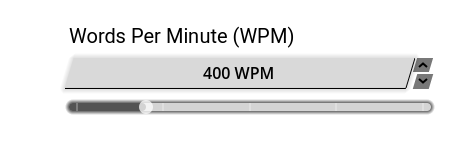
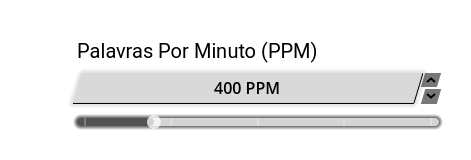

# SpeedReader

## English

A text reader made with the Godot Engine, based on the RSVP (Rapid Serial Visual Presentation) technique, where the content is displayed word by word in the same spot on the screen, allowing you to read without having to move your eyes.
You can import files such as .txt, .doc, .docx, .pdf, .epub, etc.

Ideal for studying, training your brain, speed reading, and accessibility.

You can switch between themes to find what feels most comfortable for reading.

When you start reading, you can hide the interface to read with fewer distractions and better focus.

You can also choose your reading speed, measured in Words Per Minute (WPM).

## Português

Um leitor de textos feito na Godot Engine, baseado na técnica RSVP (Rapid Serial Visual Presentation), onde o conteúdo é exibido palavra por palavra no mesmo ponto da tela, permitindo leitura sem precisar mover os olhos.  
Você pode importar arquivos como .txt, .doc, .docx, .pdf, .epub e etc.

Ideal para estudos, treinar seu cérebro, leitura rápida e acessibilidade.

Você pode variar entre os temas para o que fica mais confortável na leitura.

Se você começar a leitura, você pode esconder a interface para conseguir ler sem distrações e com mais foco.

Você também pode escolher a velocidade da sua leitura, a medida é feita em Palavras por Minuto (PPM).

